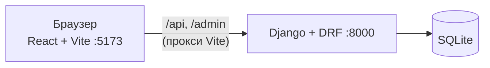

# Арес — Настольный Сайт-Хаб

Дипломный проект: веб-площадка с двумя настольными играми — **шахматами** и **крестиками-ноликами** — с игрой против компьютера, учётными записями, лидербордом, ролями администраторов и тремя темами оформления.

**Django 5.2 + Django REST Framework** на бэкенде, **React 18 + Vite** на фронтенде.

## Содержание

- [Возможности](#возможности)
- [Технологии](#технологии)
- [Как это устроено](#как-это-устроено)
- [Быстрый старт](#быстрый-старт)
- [Роли и права](#роли-и-права)
- [Команды управления](#команды-управления)
- [REST API](#rest-api)
- [Структура проекта](#структура-проекта)
- [Если что-то не работает](#если-что-то-не-работает)
- [Перед публикацией в интернете](#перед-публикацией-в-интернете)

## Возможности

### Игры

**Шахматы**

- Полные правила на основе [chess.js](https://github.com/jhlywa/chess.js): рокировка, взятие на проходе, превращение пешки, шах, мат и пат.
- Деревянная доска с текстурой, подсветка последнего хода.
- Два режима: против компьютера или вдвоём за одним устройством.
- Отмена хода и история ходов в шахматной нотации.

**Крестики-нолики**

- Классическое поле 3×3, режим против компьютера и режим для двух игроков.

**Три уровня компьютера** (в обеих играх; выбранный уровень сохраняется вместе с результатом партии):

| Уровень | Шахматы | Крестики-нолики |
| --- | --- | --- |
| Лёгкий | почти случайные ходы, предпочитает взятия | часто ходит наугад |
| Средний | минимакс на 2 хода, около 18% ходов делает случайно | считает варианты, около 30% ходов делает случайно |
| Сложный | минимакс с альфа-бета отсечением, глубина 3 | полный минимакс — компьютер непобедим |

### Аккаунты и безопасность

- Регистрация: имя 3–20 символов (латиница, цифры, `_`, `.`, `-`), пароль не короче 6 символов, e-mail необязателен. Самые простые пароли отклоняются.
- Вход по токену (DRF Token); при выходе токен удаляется.
- Защита от подбора пароля: не более 5 неудачных попыток в минуту с одного IP, дальше сервер отвечает `429`. Сообщение об ошибке не говорит, что именно неверно: имя или пароль.
- Роли выдаёт только главный администратор. Через регистрацию получить права администратора нельзя.
- **Главный администратор — только один.** Второго суперпользователя не создать ни через регистрацию, ни через админку, ни напрямую через ORM: защита стоит в менеджере модели, в `save()` и в валидации админки.

### Рейтинг

- Победа — 3 очка, ничья — 1, поражение — 0.
- Таблицы лидеров по каждой игре и общий зачёт.
- В профиле: статистика по играм и десять последних партий со сложностью и числом ходов.

### Оформление

- Три темы: **«Оригинал»** (чёрный и белый), **«Тёмный сапфир»**, **«Тёмное золото»**.
- Фон всегда чёрный: темы меняют только цвет рамок и шрифта.
- Тему можно менять только через аккаунт (страница «Профиль»); она хранится на сервере. Гостям всегда показывается «Оригинал».
- Логотип — минималистичный профиль коня (два уха, длинная морда, гладкая челюсть, глаз и ноздря вырезами) в восьмиугольной рамке, в один цвет. Он в шапке и на главной и перекрашивается вместе с темой.

### Администрирование

- Админ-панель сайта (`/admin-panel`): список пользователей, статистика по играм, назначение и снятие администратора, удаление пользователей.
- Стандартная админка Django (`/admin/`) открыта только главному администратору.

## Технологии

| Часть | Что используется |
| --- | --- |
| Бэкенд | Django 5.2.17, djangorestframework 3.18.3, django-cors-headers 4.9.0 |
| База данных | SQLite (файл `backend/db.sqlite3` создаётся автоматически) |
| Фронтенд | React 18.3, Vite 7.3, react-router-dom 7.18, chess.js 1.4 |

## Как это устроено



- **Фронтенд** рисует страницы, проверяет правила шахмат (chess.js) и считает ходы компьютера прямо в браузере. К серверу он обращается за входом, сохранением результатов и рейтингом. Токен хранится в `localStorage` и уходит в заголовке `Authorization: Token ...`.
- **В разработке** Vite проксирует `/api` и `/admin` на Django, поэтому ошибок CORS не возникает.
- **Бэкенд** состоит из двух приложений: `accounts` (пользователь, роли, вход, админ-панель) и `games` (результаты партий и лидерборд).

## Быстрый старт

Нужно: **Python 3.12+** и **Node.js 20.19+** (или 22.12+ — этого требует Vite 7). Интернет нужен только для первой загрузки пакетов.

**1. Бэкенд** (первый терминал)

```bash
cd backend
python -m venv venv
source venv/bin/activate        # Windows: venv\Scripts\activate
pip install -r requirements.txt
python manage.py migrate
python manage.py create_admin   # создаст единственного главного администратора
                                # (логин по умолчанию: exampleuser123, пароль: example444)
python manage.py runserver
```

**2. Фронтенд** (второй терминал)

```bash
cd frontend
npm install
npm run dev
```

**3. Открыть**

| Что | Адрес |
| --- | --- |
| Сайт | http://localhost:5173 |
| Админка Django | http://localhost:5173/admin/ (или http://127.0.0.1:8000/admin/) |

Проверить версию Django: `python -c "import django; print(django.get_version())"` — должно вывести `5.2.17`.

## Роли и права

| Возможность | Гость | Игрок | Администратор | Главный администратор |
| --- | :---: | :---: | :---: | :---: |
| Играть, смотреть лидерборд | ✓ | ✓ | ✓ | ✓ |
| Сохранять результаты, профиль, тема | — | ✓ | ✓ | ✓ |
| Админ-панель: пользователи и статистика | — | — | ✓ | ✓ |
| Назначать и снимать администраторов | — | — | — | ✓ |
| Удалять пользователей | — | — | — | ✓ |
| Админка Django (`/admin/`) | — | — | — | ✓ |

Главного администратора нельзя удалить, и его роль нельзя изменить. Свою роль и свой аккаунт нельзя менять и удалять через панель.

## Команды управления

Выполняются в папке `backend` с включённым виртуальным окружением.

| Команда | Что делает |
| --- | --- |
| `python manage.py create_admin` | создаёт главного администратора (один раз); без аргументов — логин `exampleuser123`, пароль `example444`; можно передать `--username`, `--email`, `--password` |
| `python manage.py setadmin <ник> on` | выдаёт права администратора сайта |
| `python manage.py setadmin <ник> off` | забирает права администратора сайта |

## REST API

Авторизация: заголовок `Authorization: Token <токен>`.

| Метод | Путь | Доступ | Назначение |
| --- | --- | --- | --- |
| POST | `/api/auth/register/` | все | регистрация |
| POST | `/api/auth/login/` | все | вход |
| POST | `/api/auth/logout/` | вошедшие | выход (токен удаляется) |
| GET, PATCH | `/api/auth/me/` | вошедшие | профиль; `PATCH` меняет тему |
| GET | `/api/auth/me/summary/` | вошедшие | статистика пользователя |
| POST | `/api/results/` | вошедшие | сохранить результат партии |
| GET | `/api/results/me/` | вошедшие | статистика и последние партии |
| GET | `/api/leaderboard/` | все | рейтинги по играм и общий |
| GET | `/api/panel/users/` | администраторы | список пользователей |
| GET | `/api/panel/stats/` | администраторы | статистика по играм |
| POST | `/api/panel/users/<id>/staff/` | главный администратор | выдать или снять права |
| POST | `/api/panel/users/<id>/delete/` | главный администратор | удалить пользователя |

## Структура проекта

```text
ares-hub/
├── backend/
│   ├── manage.py
│   ├── requirements.txt
│   ├── ares/                 настройки, корневые маршруты
│   └── apps/
│       ├── accounts/         пользователь, роли, вход, админ-панель, команды
│       └── games/            результаты партий, лидерборд
├── frontend/
│   ├── vite.config.js        прокси /api и /admin на Django
│   └── src/
│       ├── pages/            Home, Chess, TicTacToe, Leaderboard, Profile, ...
│       ├── components/       Header, Logo, KnightArt, Icons
│       ├── api.js            клиент API (токен в заголовке)
│       ├── auth.jsx          текущий пользователь и защита страниц
│       ├── theme.jsx         три темы оформления (берутся из аккаунта)
│       └── styles.css        переменные тем и общие стили
└── ШПАРГАЛКА_ЗАПУСКА.txt     краткая инструкция по запуску
```

## Если что-то не работает

- **Порт 8000 занят.** Запустите `python manage.py runserver 8001` и поменяйте `8000` на `8001` в `frontend/vite.config.js`.
- **Фронтенд не видит API.** Проверьте, что Django запущен на порту 8000, а Vite — командой `npm run dev` (прокси настраивается сам).
- **Начать с чистой базы.** Удалите `backend/db.sqlite3` и снова выполните `migrate` и `create_admin`.
- **Забыли пароль главного администратора.** Восстановить суперпользователя нельзя, потому что он один. Пересоздайте базу, как описано выше, либо создайте обычного пользователя и выдайте ему права: `setadmin <ник> on`.
- **Ошибка про `corsheaders`.** Зависимости не установлены: выполните `pip install -r requirements.txt`.

## Перед публикацией в интернете

Проект настроен для локального запуска. Для публикации задайте переменные окружения:

| Переменная | Значение |
| --- | --- |
| `DJANGO_SECRET_KEY` | свой длинный случайный ключ |
| `DJANGO_DEBUG` | `0` |
| `DJANGO_ALLOWED_HOSTS` | ваши домены через запятую, например `mydomain.ru,www.mydomain.ru` |
| `CORS_ALLOW_ALL` | `0` (разрешённые адреса задаются в `CORS_ALLOWED_ORIGINS` в `settings.py`) |

Счётчик неудачных входов хранится в памяти процесса и сбрасывается при перезапуске сервера. Для нескольких процессов потребуется общее хранилище.
